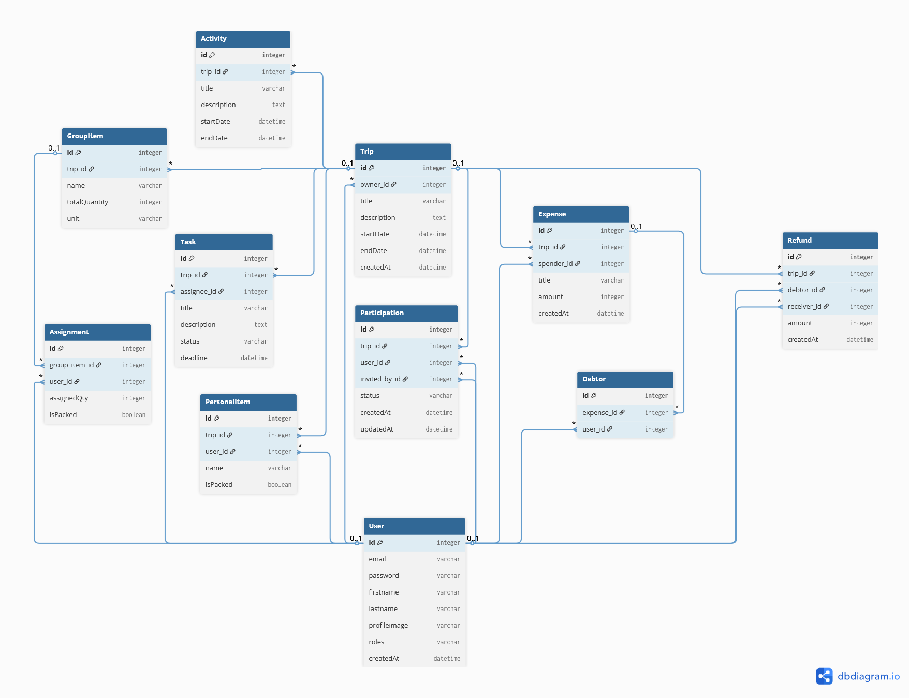

# Structure de la Base de Données

Cette section détaille la conception de la base de données du projet **TroupTrip**.

---

## Sommaire
* [1 - Schéma de la base de données](#1-schéma-de-la-base-de-donnée)
* [2 - Code Source (Format DBML)](#2-code-source-format-dbml)
* [3 - Spécifications des données](#3-spécifications-des-données)
    * [3.1 - Utilisateurs et Séjour](#31-utilisateurs-et-séjour)
    * [3.2 - Planification](#32-planification)
    * [3.3 - Logistique](#33-logistique)
    * [3.4 - Finances et Remboursements](#34-finances-et-remboursements)

---

## 1 - Schéma de la base de donnée


*Généré via dbdiagram.io*

---

## 2 - Code Source (Format DBML)

Pour modifier ce schéma, copiez le code ci-dessous et collez-le dans [dbdiagram.io](https://dbdiagram.io).

<details>
<summary>Cliquez pour afficher le code DBML</summary>

```dbml
// --- UTILISATEURS ---
Table User {
  id integer [primary key]
  email varchar [unique]
  password varchar
  firstname varchar
  lastname varchar
  profileimage varchar [null]
  roles varchar [note: 'JSON array (ex: ["ROLE_USER"])']
  createdAt datetime
}

// --- VOYAGES & ACCÈS ---
Table Trip {
  id integer [primary key]
  owner_id integer [ref: > User.id] // Le créateur/responsable
  title varchar
  description text
  startDate datetime
  endDate datetime
  createdAt datetime
}

// L'entité pivot "intelligente"
Table Participation {
  id integer [primary key]
  trip_id integer [ref: > Trip.id]
  user_id integer [ref: > User.id]
  invited_by_id integer [ref: > User.id, null]
  status varchar [note: 'pending, accepted, declined, left, excluded']
  createdAt datetime
  updatedAt datetime
}

// --- ORGANISATION ---
Table Activity {
  id integer [primary key]
  trip_id integer [ref: > Trip.id]
  title varchar
  description text
  startDate datetime
  endDate datetime
}

Table Task {
  id integer [primary key]
  trip_id integer [ref: > Trip.id]
  assignee_id integer [ref: > User.id, null]
  title varchar
  description text
  status varchar [note: 'todo, in_progress, done']
  deadline datetime
}

// --- LOGISTIQUE (Le cœur de l'app) ---

// Ce que le groupe doit avoir (ex: 2 Réchauds, 1 Tente)
Table GroupItem {
  id integer [primary key]
  trip_id integer [ref: > Trip.id]
  name varchar
  totalQuantity integer
  unit varchar [null, note: 'ex: kg, pack, pièces']
}

// Qui s'engage à amener quoi (ex: Luc amène 1 réchaud sur les 2)
Table Assignment {
  id integer [primary key]
  group_item_id integer [ref: > GroupItem.id]
  user_id integer [ref: > User.id]
  assignedQty integer
  isPacked boolean [default: false]
}

// Liste personnelle (ex: Ma brosse à dents, mes médicaments)
Table PersonalItem {
  id integer [primary key]
  trip_id integer [ref: > Trip.id]
  user_id integer [ref: > User.id]
  name varchar
  isPacked boolean [default: false]
}

// --- FINANCES (Gestion des comptes) ---
Table Expense {
  id integer [primary key]
  trip_id integer [ref: > Trip.id]
  spender_id integer [ref: > User.id]
  title varchar
  amount integer [note: 'Stocké en centimes']
  createdAt datetime
}

Table Debtor {
  id integer [primary key]
  expense_id integer [ref: > Expense.id]
  user_id integer [ref: > User.id]
}

Table Refund {
  id integer [primary key]
  trip_id integer [ref: > Trip.id]
  debtor_id integer [ref: > User.id] // Celui qui paie
  receiver_id integer [ref: > User.id] // Celui qui reçoit
  amount integer
  createdAt datetime
}
```
</details>

---

## 3 - Spécifications des données

### 3.1 - Utilisateurs et Séjour

#### 3.1.1 - Table User

Elle recense chaque individu inscrit. L'adresse email sert d'identifiant unique pour l'authentification. 
Elle centralise les informations de profil et les rôles applicatifs.

#### 3.1.2 - Table Trip

Représente les séjours créés dans l'application. Elle est liée à un User (propriétaire) qui en est le créateur et responsable légitime. 
Un séjour ne peut exister sans créateur, garantissant ainsi qu'il y a toujours un administrateur référent.

Cette table répond à la question suivante: **Où part-on ?**

#### 3.1.3 - Table Participation

Gère la relation (le "contrat") entre un utilisateur et un séjour. Elle définit qui participe à quoi et avec quel niveau 
d'engagement via un système de statuts.

Liste non exhaustive des status:
- **PENDING** : Invitation envoyée, en attente de réponse.
- **ACCEPTED** : Participation confirmée.
- **DECLINED** : Invitation refusée.
- **LEFT** : L'utilisateur a quitté le séjour de son plein gré. 
- **CANCELLED** : La participation a été annulée par l'organisateur.

Cette table répond aux questions suivantes: **Qui participe au séjour ? Qui a été invité ? Qui a refusé ?**

### 3.2 - Planification

#### 3.2.1 - Table Activity

Regroupe les événements planifiés (visites, trajets, repas) qui structurent l'agenda du séjour. 
Contrairement à une tâche, l'activité est définie par un créneau temporel précis (startDate / endDate) et concerne 
généralement l'ensemble du groupe. Elle est le socle du planning.

Cette table répond à la question suivante: **Qu'a t-on prévu de faire pendant le séjour ?**

#### 3.2.2 - Table Task

Répertorie les actions à accomplir pour la préparation ou le bon déroulement du séjour. Sa force réside dans sa clé 
étrangère vers User optionnelle (nullable), permettant de lister des besoins avant de savoir qui s'en chargera. 

Liste non exhaustive des status:
- **TODO** : A faire
- **IN_PROGRESS** : En cours
- **DONE** : Terminée

Cette table répond à la question suivante: **Qui fais quoi ?**

### 3.3 - Logistique

#### 3.3.1 - Table GroupItem

Définit les besoins matériels collectifs du séjour (ex: 2 réchauds, une trousse de secours, 6 chaises). 
C'est l'inventaire du groupe pour le séjour.

Cette table répond à la question suivante: **De quoi a t-on besoin collectivement ?**

#### 3.3.2 - Table Assignment

Associe un utilisateur à un besoin matériel collectif. Elle permet de fractionner la quantité d'un GroupItem 
(ex: Luc amène 1 réchaud sur les 2 demandés). Le champ isPacked permet de suivre l'état de préparation physique avant le départ.

Cette table répond à la question suivante: **Qui amène quoi ?**

#### 3.3.3 - Table PersonalItem

Liste d'inventaire strictement privée pour chaque participant (ex: brosse à dents, chargeur). 
Elle permet à l'utilisateur de s'organiser sans encombrer l'inventaire collectif.
Le champ isPacked permet de suivre l'état de préparation physique avant le départ.

Cette table répond à la question suivante: **De quoi ai-je besoin personellement ?**

### 3.4 - Finances et Remboursements

#### 3.4.1 - Table Expense

Enregistre chaque dépense effectuée par un membre du groupe. Le montant est stocké en centimes (Integer) pour éviter 
les problèmes d'arronis liés aux sommes conservées en float.

Cette table répond à la question suivante: **Qui a dépensé quoi ?**

#### 3.4.2 - Table Debtor

Définit la répartition d'une dépense. Chaque entrée lie un utilisateur à une dépense dont il est redevable.

Cette table répond à la question suivante: **Qui dois de l'argent à qui ?**

#### 3.4.3 - Table Refund

Enregistre les transactions de remboursement entre deux utilisateurs. Elle n'est volontairement pas liée à une dépense 
précise pour permettre un remboursement global (ex: un seul virement pour rembourser trois dettes distinctes) plutôt que
des dépenses distinctes.

Cette table répond à la question suivante: **Qui a remboursé qui ?**

Les tables Expense, Debtor et Refund sont à la base d'un système d'affichage de remboursement en temps réel, 
de remboursement par balance globale et de transferts optimisés entre les participants du séjour.