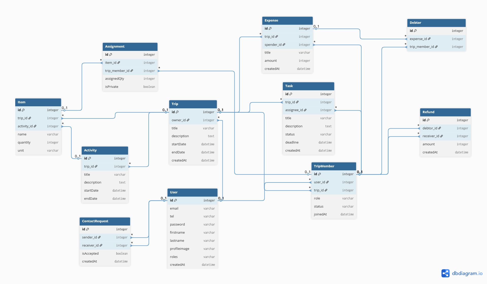

# Structure de la Base de Données

Cette section détaille la conception de la base de données du projet **TroupTrip**.

## Schéma de la base de donnée


*Généré via dbdiagram.io*

## Code Source (Format DBML)

Pour modifier ce schéma, copiez le code ci-dessous et collez-le dans [dbdiagram.io](https://dbdiagram.io).

<details>
<summary>Cliquez pour afficher le code DBML</summary>

```dbml
Table User {
  id integer [primary key]
  email varchar [unique]
  tel varchar
  password varchar
  firstname varchar
  lastname varchar
  profileimage varchar
  roles varchar [note: 'Role global application']
  createdAt datetime
}

Table ContactRequest {
  id integer [primary key]
  sender_id integer
  receiver_id integer
  isAccepted boolean [default: false]
  createdAt datetime
}

Table Trip {
  id integer [primary key]
  owner_id integer [note: 'Créateur du voyage']
  title varchar
  description text
  startDate datetime
  endDate datetime
  createdAt datetime
}

Table TripMember {
  id integer [primary key]
  user_id integer
  trip_id integer
  role varchar [note: 'Admin, Participant, Guest']
  status varchar [note: 'Pending, Accepted, Declined']
  joinedAt datetime
}

Table Activity {
  id integer [primary key]
  trip_id integer
  title varchar
  description text
  startDate datetime
  endDate datetime
}

Table Task {
  id integer [primary key]
  trip_id integer
  assignee_id integer [note: 'TripMember assigné', null]
  title varchar
  description text
  status varchar [note: 'Todo, In Progress, Done, Cancelled']
  deadline datetime
  createdAt datetime
}

Table Item {
  id integer [primary key]
  trip_id integer
  activity_id integer [null]
  name varchar
  quantity integer
  unit varchar [note: 'kg, unit, L']
}

Table Assignment {
  id integer [primary key]
  item_id integer
  trip_member_id integer
  assignedQty integer
  isPrivate boolean [default: false]
}

Table Expense {
  id integer [primary key]
  trip_id integer
  spender_id integer [note: 'Celui qui a payé la facture']
  title varchar
  amount integer [note: 'Montant tde la dépense en centimes']
  createdAt datetime
}

Table Debtor {
  id integer [primary key]
  expense_id integer
  trip_member_id integer [note: 'Celui qui bénéficie de la dépense']
}

Table Refund {
  id integer [primary key]
  debtor_id integer [note: 'Celui qui rembourse']
  receiver_id integer [note: 'Celui qui reçoit l argent']
  amount integer [note: 'Montant en centimes']
  createdAt datetime
}

Ref: ContactRequest.sender_id > User.id
Ref: ContactRequest.receiver_id > User.id

Ref: Trip.owner_id > User.id
Ref: TripMember.user_id > User.id
Ref: TripMember.trip_id > Trip.id

Ref: Activity.trip_id > Trip.id
Ref: Task.trip_id > Trip.id
Ref: Task.assignee_id > TripMember.id
Ref: Item.trip_id > Trip.id
Ref: Item.activity_id > Activity.id
Ref: Assignment.item_id > Item.id
Ref: Assignment.trip_member_id > TripMember.id

Ref: Expense.trip_id > Trip.id
Ref: Expense.spender_id > TripMember.id
Ref: Debtor.expense_id > Expense.id
Ref: Debtor.trip_member_id > TripMember.id
Ref: Refund.debtor_id > TripMember.id
Ref: Refund.receiver_id > TripMember.id
```
</details>