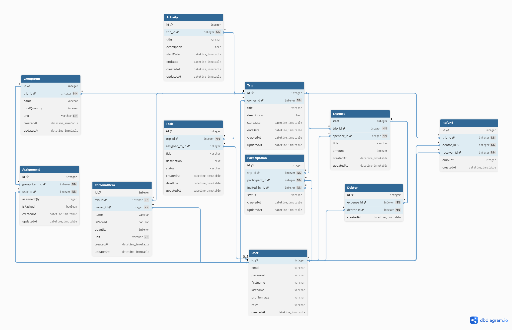

# Structure de la Base de Données

Cette section détaille la conception de la base de données du projet **TroupTrip**.

---

## Sommaire
* [1 - Schéma de la base de données](#1---schéma-de-la-base-de-données)
* [2 - Code Source (Format DBML)](#2---code-source-format-dbml)
* [3 - Spécifications des données](#3---spécifications-des-données)
    * [3.1 - Utilisateurs et Séjour](#31---utilisateurs-et-séjour)
    * [3.2 - Planification](#32---planification)
    * [3.3 - Logistique](#33---logistique)
    * [3.4 - Finances et Remboursements](#34---finances-et-remboursements)

---

## 1 - Schéma de la base de données


*Généré via dbdiagram.io*

---

## 2 - Code Source (Format DBML)

Pour modifier ce schéma, copiez le code ci-dessous et collez-le dans [dbdiagram.io](https://dbdiagram.io).

<details>
<summary>Cliquez pour afficher le code DBML</summary>

```dbml
Table User {
  id integer [primary key]
  email varchar [unique]
  password varchar
  firstname varchar
  lastname varchar
  profileimage varchar [null]
  roles varchar [note: 'JSON array (ex: ["ROLE_USER"])']
  createdAt datetime_immutable
}

Table Trip {
  id integer [primary key]
  owner_id integer [ref: > User.id, not null] // Le créateur/responsable
  title varchar
  description text
  startDate datetime_immutable
  endDate datetime_immutable
  createdAt datetime_immutable
  updatedAt datetime_immutable [null]
}

Table Participation {
  id integer [primary key]
  trip_id integer [ref: > Trip.id, not null]
  participant_id integer [ref: > User.id, not null]
  invited_by_id integer [ref: > User.id, not null]
  status varchar [note: 'PENDING, ACCEPTED, DECLINED, LEFT, EXCLUDED']
  createdAt datetime_immutable
  updatedAt datetime_immutable [null]
}

Table Activity {
  id integer [primary key]
  trip_id integer [ref: > Trip.id, not null]
  title varchar
  description text [null]
  startDate datetime_immutable
  endDate datetime_immutable
  createdAt datetime_immutable
  updatedAt datetime_immutable [null]
}

Table Task {
  id integer [primary key]
  trip_id integer [ref: > Trip.id, not null]
  assigned_to_id integer [ref: > User.id, null]
  title varchar
  description text [null]
  status varchar [note: 'TODO, IN_PROGRESS, DONE']
  createdAt datetime_immutable
  deadline datetime_immutable
  updatedAt datetime_immutable [null]
}

Table GroupItem {
  id integer [primary key]
  trip_id integer [ref: > Trip.id, not null]
  name varchar
  totalQuantity integer
  unit varchar [not null, note: 'ex: kg, pack, pièces']
  createdAt datetime_immutable
  updatedAt datetime_immutable [null]
}

Table Assignment {
  id integer [primary key]
  group_item_id integer [ref: > GroupItem.id, not null]
  user_id integer [ref: > User.id, not null]
  assignedQty integer
  isPacked boolean [default: false]
  createdAt datetime_immutable
  updatedAt datetime_immutable [null]
}

Table PersonalItem {
  id integer [primary key]
  trip_id integer [ref: > Trip.id, not null]
  owner_id integer [ref: > User.id, not null]
  name varchar
  isPacked boolean [default: false]
  quantity integer
  unit varchar [not null, note: 'ex: kg, pack, pièces']
  createdAt datetime_immutable
  updatedAt datetime_immutable [null]
}

Table Expense {
  id integer [primary key]
  trip_id integer [ref: > Trip.id, not null]
  spender_id integer [ref: > User.id, not null]
  title varchar
  amount integer [note: 'Stocké en centimes']
  createdAt datetime_immutable
  updatedAt datetime_immutable [null]
}

Table Debtor {
  id integer [primary key]
  expense_id integer [ref: > Expense.id, not null]
  debtor_id integer [ref: > User.id, not null]
  createdAt datetime_immutable
}

Table Refund {
  id integer [primary key]
  trip_id integer [ref: > Trip.id, not null]
  debtor_id integer [ref: > User.id, not null] // Celui qui paie
  receiver_id integer [ref: > User.id, not null] // Celui qui reçoit
  amount integer
  createdAt datetime_immutable
}
```
</details>

---

## 3 - Spécifications des données

### 3.1 - Utilisateurs et Séjour

#### 3.1.1 - Table User

Elle recense chaque individu inscrit. L'adresse email sert d'identifiant unique pour l'authentification. 
Elle centralise les informations de profil et les rôles applicatifs.

#### 3.1.2 - Table Trip

Représente les séjours créés dans l'application. Elle est liée à un User (propriétaire) qui en est le créateur et responsable légitime. 
Un séjour ne peut exister sans créateur, garantissant ainsi qu'il y a toujours un administrateur référent.

Cette table répond à la question : **Où part-on ?**

#### 3.1.3 - Table Participation

Gère la relation (le "contrat") entre un utilisateur et un séjour. Elle définit qui participe à quoi et avec quel niveau 
d'engagement via un système de statuts.

Liste non exhaustive des status:
- **PENDING** : Invitation envoyée, en attente de réponse.
- **ACCEPTED** : Participation confirmée.
- **DECLINED** : Invitation refusée.
- **LEFT** : L'utilisateur a quitté le séjour de son plein gré. 
- **CANCELLED** : La participation a été annulée par l'organisateur.

Cette table répond aux questions : **Qui participe au séjour ? Qui a été invité ? Qui a refusé ?**

### 3.2 - Planification

#### 3.2.1 - Table Activity

Regroupe les événements planifiés (visites, trajets, repas) qui structurent l'agenda du séjour. 
Contrairement à une tâche, l'activité est définie par un créneau temporel précis (startDate / endDate) et concerne 
généralement l'ensemble du groupe. Elle est le socle du planning.

Cette table répond à la question : **Qu'a t-on prévu de faire pendant le séjour ?**

#### 3.2.2 - Table Task

Répertorie les actions à accomplir pour la préparation ou le bon déroulement du séjour. Sa force réside dans sa clé 
étrangère vers User optionnelle (nullable), permettant de lister des besoins avant de savoir qui s'en chargera. 

Liste non exhaustive des status:
- **TODO** : A faire
- **IN_PROGRESS** : En cours
- **DONE** : Terminée

Cette table répond à la question : **Qui fais quoi ?**

**Note:** La clé étrangère assigned_to_id vers User est volontairement laissée nullable. Ce choix donne la possibilité de créer 
des tâches sans les assigner et ainsi laisser les membres du groupes se porter volontaire pour l'assignation.

### 3.3 - Logistique

#### 3.3.1 - Table GroupItem

Définit les besoins matériels collectifs du séjour (ex: 2 réchauds, une trousse de secours, 6 chaises). 
C'est l'inventaire du groupe pour le séjour.

Cette table répond à la question : **De quoi a t-on besoin collectivement ?**

#### 3.3.2 - Table Assignment

Associe un utilisateur à un besoin matériel collectif. Elle permet de fractionner la quantité d'un GroupItem 
(ex: Luc amène 1 réchaud sur les 2 demandés). Le champ isPacked permet de suivre l'état de préparation physique avant le départ.

Cette table répond à la question: **Qui amène quoi ?**

#### 3.3.3 - Table PersonalItem

Liste d'inventaire strictement privée pour chaque participant (ex: brosse à dents, chargeur). 
Elle permet à l'utilisateur de s'organiser sans encombrer l'inventaire collectif.
Le champ isPacked permet de suivre l'état de préparation physique avant le départ.

Cette table répond à la question : **De quoi ai-je besoin personellement ?**

**Note:** PersonalItem et GroupItem ont de nombreuses propriétés communes, et il a été envisagé à un moment de n'avoir qu'une seule
table Item, avec une propriété isPrivate pour assurer le caractère privée d'un Item. Toutefois GroupItem gère une logique 
collaborative assez riche (notamment avec le fractionnement des quantités par User via la table Assignment), 
tandis que PersonalItem est une simple check-list individuelle et privée. Les objets représenté par chacunes de ces entités ont
finalement des comportements assez différents. Les séparer permet de garder des requêtes simples, plus performantes et un code 
plus lisible et donc plus maintenable. Cette distinction permet également de garder une base de donnée plus évolutive.
Si on tient compte de tous ces avantages, cette duplication est acceptable.

### 3.4 - Finances et Remboursements

#### 3.4.1 - Table Expense

Enregistre chaque dépense effectuée par un membre du groupe. Le montant est stocké en centimes (Integer) pour éviter 
les problèmes d'arronis liés aux sommes conservées en float.

Cette table répond à la question : **Qui a dépensé quoi ?**

#### 3.4.2 - Table Debtor

Définit la répartition d'une dépense. Chaque entrée lie un utilisateur à une dépense dont il est redevable.

Cette table répond à la question : **Qui dois de l'argent à qui ?**

#### 3.4.3 - Table Refund

Enregistre les transactions de remboursement entre deux utilisateurs. Elle n'est volontairement pas liée à une dépense 
précise pour permettre un remboursement global (ex: un seul virement pour rembourser trois dettes distinctes) plutôt que
des dépenses distinctes.

Cette table répond à la question : **Qui a remboursé qui ?**

**Note:** Les tables Expense, Debtor et Refund sont à la base d'un système d'affichage de remboursement en temps réel, 
de remboursement par balance globale et de transferts optimisés entre les participants du séjour.